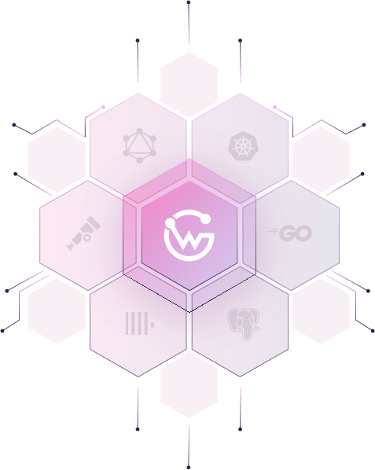

<p align="center">

</p>

<div align="center">
<h5>WunderGraph Cosmo - The GraphQL federation platform</h5>
<h6><i>Reach for the stars, ignite your cosmo!</i></h6>


<hr />
</div>

## We're hiring!

<br/>

Are you interested in working on graphql-go-tools, the "Engine" of Cosmo Router?
We're looking for experienced Go developers and DevOps or Platform Engineering specialists to help us run Cosmo Cloud.
If you're more interested in working with Customers on their GraphQL Strategy,
we also offer Solution Architect positions.

Check out the [currently open positions](https://wundergraph.com/jobs#open-positions).

## Overview

<br/>

WunderGraph Cosmo is the full Lifecycle API Management for (Federated) GraphQL. Schema Registry, composition checks, analytics, metrics, tracing and routing. Deploy 100% on-prem or use our [Managed Service](https://cosmo.wundergraph.com/login). Apache 2.0 licensed, no vendor-lock. The platform consists of the following components:

Core:

- [CLI](./cli): The Cosmo CLI tool `wgc`. Used to manage the Cosmo platform e.g. pushing schema, check schemas, creating new projects, managing users, etc. It interacts with the control plane.
- [Control Plane](./controlplane): The control plane is the central component of the Cosmo platform. It consists of a platform API and a node API. The platform API is used by the cosmo `CLI` tool and the `Studio` to manage the platform.
- [Router](./router): The router is the component that understands the GraphQL Federation protocol. It is responsible for routing requests to the correct service and for aggregating the responses. It is in connection with the control plane to register itself for advanced cluster management.
- [Studio](./studio): The studio is the web interface for the Cosmo platform. It is used to manage the platform and to collaborate on GraphQL Federation. It is in connection with the control plane through the Platform API to manage the platform.

Collectors:

- [OpenTelemetry Collector](./otelcollector): The OpenTelemetry Collector is used to collect and export metrics and traces from the platform. It is configured to collect metrics and traces from the `router` and instrumented `subgraphs`.
- [GraphQLMetrics Collector](./graphqlmetrics): The GraphQLMetrics collector is used to collect and export metrics from the platform that doesn't fit into the OpenTelemetry model. Primarily, it is used to collect operation usage metrics from the `router` to allow advanced breaking changes analysis of client applications.

## Migrate from Apollo GraphOS / Apollo Federation

We've made it super easy for you to migrate from Apollo by using our fully automatic [Migration Assistant](https://cosmo-docs.wundergraph.com/studio/migrate-from-apollo).
[Signup](https://cosmo.wundergraph.com/login) to Cosmo Cloud, enter your Graph API Token and Graph variant, and the Assistant migrates over your Graph in just a few seconds.
That's it, migrate over with a single click!

## Demo Cosmo on your machine in 3 minutes

### Prerequisites

- [Docker](https://docs.docker.com/get-docker/)
- [Docker Compose](https://docs.docker.com/compose/install/) (version 2+ only)
- [NPM](https://nodejs.org/en/download/) (for the Cosmo CLI)

Running Cosmo is as easy as running a single command. It can take a few minutes (~1-2m) until all services are up and running. A seed container and few migrations are running in the background to bootstrap the platform.
They might restart a few times until the database is ready. Creates a small demo project and starts the router and subgraphs:

> [!WARNING]  
> Please give Docker Desktop enough resources (CPU, Memory) to run the platform. We recommend at least 4 CPUs and 8GB of memory.

1. Start the platform:

```shell
make full-demo-up
```

2. Navigate to the [Studio Playground](http://localhost:3000/wundergraph/default/graph/mygraph/playground) and query the router. Login with the default credentials:

```
Username: foo@wundergraph.com
Password: wunder@123
```

3. If you are done, you can clean up the demo by running `make full-demo-down`.

## Local Development

### Prerequisites

- [Docker](https://docs.docker.com/get-docker/)
- [Docker Compose V2](https://docs.docker.com/compose/install/)
- [NodeJS LTS](https://nodejs.org/en/download/)
- [PNPM 8+](https://pnpm.io/installation)
- [Go 1.21+](https://golang.org/doc/install)
- [wgc](https://www.npmjs.com/package/wgc)
- .env/.env.local (see below)

All services work with environment variables. You can find the default values in the `.env.example` file. 
Please copy the variables to `.env` (the same for studio but with `.env.local`) and adjust the values to your needs.

Bootstrapping your development environment is easy. Just run the following commands in order:

```shell
# 1️⃣ Setup the repository, build libraries and start all services (Wait a few seconds until Keycloak is ready)
make

# 2️⃣ Run migrations and seed the database
make migrate && make seed

# 3️⃣ Start the control plane
make start-cp

# 4️⃣⃣ Create the demo and copy the JWT printed at the bottom
make create-demo

# 5️⃣ Start the subgraphs
OTEL_AUTH_TOKEN=<jwt-token> make dc-subgraphs-demo

# 6️⃣⃣ Put the JWT from the previous step into the router/.env as GRAPH_API_TOKEN and start the router
make start-router

# ✨ Finally, Start the studio (http://localhost:3000) and explore the Cosmo platform
make start-studio
```

Navigate to [http://localhost:3000/](http://localhost:3000/) and login with the default credentials:

```
Username: foo@wundergraph.com
Password: wunder@123
```

Your API key to access the platform is: `cosmo_669b576aaadc10ee1ae81d9193425705`. Set the following environment variable to use it with the CLI:

```shell
export COSMO_API_KEY=cosmo_669b576aaadc10ee1ae81d9193425705
export COSMO_API_URL=http://localhost:3001
export KC_API_URL=http://localhost:8080
export CDN_URL=http://localhost:11000

cd cli && pnpm wgc -h
```

_Clean up all containers and volumes by running `make infra-down-v`._

### Docker Compose

We manage multiple compose files:

- `docker-compose.yml`: The default compose file. It contains all services that are required to run the platform for development.
- `docker-compose.full.yml`: This compose file contains the full Cosmo platform. It is used for demo and testing.
- `docker-compose.cosmo.yml`: This compose file allows to build all Cosmo components and manage them in a single compose file. It is used for testing and releasing.

**Clean up a compose stack before starting another one!**

## On-Premise

Cosmo was designed to be deployed on-premise e.g. Kubernetes. We provide a helm chart to deploy the platform on any Kubernetes like AKS, GKE, AKS or Minikube. You can find the helm chart in the [helm](./helm) directory.
If you need help with the deployment, please contact us [here](https://form.typeform.com/to/oC6XATf4).

## Managed Service

If you don't want to manage the platform yourself, you can use our managed service [WunderGraph Cosmo Cloud](https://cosmo.wundergraph.com/). It is a fully managed platform that eliminates your worries about infrastructure, allowing you to concentrate on building. This managed service includes a generous free tier of 10 million monthly requests. If you require extended data retention or are subject to strict compliance requirements, please [contact us](https://wundergraph.com/contact/sales). We offer custom plans for Hybrid SaaS and On-Premises deployments.

## License

Cosmo is licensed under the [Apache License, Version 2.0](LICENSE).
