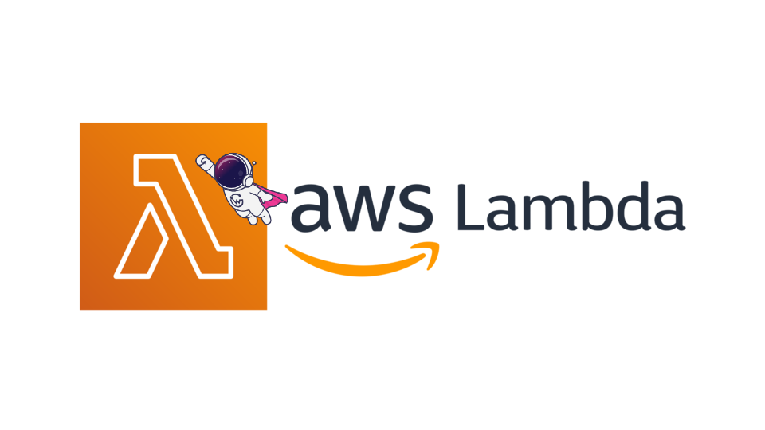

# aws-lambda-router

<p align="center">

</p>

This is the [AWS Lambda](https://aws.amazon.com/lambda/) version of the WunderGraph Cosmo [Router](https://wundergraph.com/cosmo/features/router). Please [contact](https://wundergraph.com/contact/sales) us if you have any questions or production use case.

Why AWS lambda? Because it's cheap and scales automatically. You only pay for what you use. No need to manage servers or containers. It also integrates well with the rest of the AWS ecosystem.

Status: **Beta**

- [X] GraphQL Queries
- [X] GraphQL Mutations
- [X] Telemetry Flushing after each request
- [X] Schema Usage Tracking after each request
- [ ] Subscription: Not implemented. Please [talk to us](https://wundergraph.com/contact/sales) if you need this.

## Requirements

* AWS CLI already configured with Administrator permission
* [Docker installed](https://www.docker.com/community-edition)
* [Golang](https://golang.org)
* SAM CLI - [Install the SAM CLI](https://docs.aws.amazon.com/serverless-application-model/latest/developerguide/serverless-sam-cli-install.html)

## Setup process

### Cosmo Cloud

Signup For Cosmo Cloud and follow the [onboarding](https://cosmo-docs.wundergraph.com/tutorial/cosmo-cloud-onboarding) process.

Run `make fetch-router-config` to fetch the latest router configuration from Cosmo Cloud. We assume that you have named your graph `production`.
The file is stored in `router.json` and copied to the Lambda build directory on each build.

### Installing dependencies & building the target 

In this example we use the built-in `sam build` to automatically download all the dependencies and package our build target.   
Read more about [SAM Build here](https://docs.aws.amazon.com/serverless-application-model/latest/developerguide/sam-cli-command-reference-sam-build.html) 

The `sam build` command is wrapped inside the `Makefile`. To execute this simply run
 
```shell
make build
```

### Local development

Start the API Gateway locally

```bash
make dev
```

Open [http://127.0.0.1:3003/](http://127.0.0.1:3003/) in your browser and you should see the GraphQL Playground.

### Deploy on code change

This will upload the code to AWS without performing a CloudFormation deployment. This is useful for development.

```bash
make sync
```

### Deploying application

Ensure that the environment variables `STAGE` and `GRAPH_API_TOKEN` are set in the [template.yaml](template.yaml) before deploying. For production use cases, we recommend to use [AWS Secrets Manager](https://aws.amazon.com/secrets-manager/) to store the `GRAPH_API_TOKEN`.

```bash
make deploy
```

The command will package and deploy your application to AWS.
You can find your API Gateway Endpoint URL in the output values displayed after deployment.

# User Guide

1. Download the Lambda Router binary from the official [Router Releases](https://github.com/wundergraph/cosmo/releases?q=aws-lambda-router&expanded=true) page.
2. Create a .zip archive with the binary and the `router.json` file. You can download the latest `router.json` with [`wgc federated-graph fetch`](https://cosmo-docs.wundergraph.com/cli/federated-graph/fetch).
```
.
└── myFunction.zip/
    ├── bootstrap
    └── config.json
```
3. Deploy the .zip archive to AWS Lambda. You can use AWS cli or the AWS console. Alternatively, you can use your IaC tool of choice.
