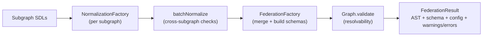

# Composition Architecture and Onboarding (TypeScript)

This is a beginner-friendly guide to the `composition` package.

Scope:
- In scope: `composition/*`
- Out of scope: `composition-go/*`

## Who this is for

Use this doc if you are:
- new to this repository,
- trying to understand where composition errors come from,
- adding or shipping custom directives.

## 1. What this package produces

Given one or more subgraph SDLs, composition produces:
- a federated router schema,
- a federated client schema,
- router configuration metadata,
- warnings and errors.

Main API exports:
- `composition/src/index.ts`

Main functions:
- `federateSubgraphs(...)`
- `federateSubgraphsWithContracts(...)`
- `federateSubgraphsContract(...)`
- `normalizeSubgraph(...)`
- `batchNormalize(...)`

## 2. Mental model (simple)

Think of composition as a 4-stage pipeline:
1. Normalize each subgraph.
2. Batch-check all normalized subgraphs together.
3. Merge everything into one federated model.
4. Validate resolvability and emit final schemas.

## 3. Where each stage lives

### Stage 1: Normalize one subgraph

Main files:
- `composition/src/v1/normalization/normalization-factory.ts`
- `composition/src/v1/normalization/walkers.ts`
- `composition/src/v1/normalization/utils.ts`

What happens here:
- Parse and validate SDL and directives.
- Build internal type/field model (`ParentDefinitionData`, `FieldData`, etc.).
- Validate federation directives (`@key`, `@requires`, `@provides`, `@override`, etc.).
- Build type-level router configuration (`ConfigurationData`).
- Record graph edges for later resolvability checks.

### Stage 2: Batch normalization

Main file:
- `composition/src/v1/normalization/normalization-factory.ts` (`batchNormalize`)

What happens here:
- Validate subgraph naming/uniqueness.
- Normalize each subgraph into shared structures.
- Merge cross-subgraph metadata (entities, auth, overrides, coordinates).
- Produce `internalSubgraphBySubgraphName` used by federation.

### Stage 3: Federation merge

Main file:
- `composition/src/v1/federation/federation-factory.ts`

What happens here:
- Merge all normalized types and fields.
- Reconcile incompatible shapes and directive usage.
- Build router/client schema definitions.
- Build final field configuration output.

### Stage 4: Resolvability validation

Main files:
- `composition/src/resolvability-graph/graph.ts`
- `composition/src/resolvability-graph/graph-nodes.ts`

What happens here:
- Validate that required field paths are actually reachable.
- Return errors if fields cannot be resolved across subgraphs.

## 4. Request flow from public API

Top-level function:
- `composition/src/federation/federation.ts`

Current compatibility:
- only version `"1"` is supported (`composition/src/router-compatibility-version/router-compatibility-version.ts`).

Effective flow:
1. `federateSubgraphs(...)`
2. `initializeFederationFactory(...)`
3. `batchNormalize(...)`
4. `FederationFactory.federateSubgraphData()`
5. `FederationFactory.buildFederationResult()`

## 5. Core data structures (quick glossary)

Result types:
- `composition/src/federation/types.ts`
- `composition/src/normalization/types.ts`
- `composition/src/subgraph/types.ts`

Most important internals:
- `InternalSubgraph`: normalized per-subgraph state fed into federation.
- `ParentDefinitionData`: canonical representation of a type in normalization/federation.
- `PersistedDirectiveDefinitionData`: executable directive definition info considered for federated schema persistence.
- `ConfigurationData`: per-type router configuration source.

## 6. Directives: how the system is designed

There are two broad categories:
1. Built-in directives with composition semantics.
2. Custom executable directives that can be validated and persisted.

### Built-in directives

Definition and registration:
- `composition/src/v1/constants/directive-definitions.ts`
- `composition/src/v1/constants/constants.ts`
- `composition/src/v1/constants/strings.ts`
- `composition/src/utils/string-constants.ts`

Normalization uses a directive registry (`directiveDefinitionDataByName`) to validate use sites and arguments.

### Custom directives

During normalization, unknown directive definitions are treated as custom:
- parsed and validated,
- added to normalized directive maps,
- included in normalized subgraph AST.

Key implementation points:
- `upsertDirectiveSchemaAndEntityDefinitions(...)`
- `addDirectiveDefinitionDataByNode(...)`

Both are in:
- `composition/src/v1/normalization/normalization-factory.ts`
- `composition/src/v1/normalization/walkers.ts`

### Directive persistence across subgraphs

During federation, executable directive definitions are only persisted when compatible across subgraphs.

Compatibility rules (important):
- The definition must exist consistently across participating subgraphs.
- Executable locations are intersected (must remain non-empty).
- Argument definitions must merge cleanly.
- Repeatability must remain compatible.

Core methods:
- `upsertPersistedDirectiveDefinitionData(...)`
- `addValidPersistedDirectiveDefinitionNodeByData(...)`

Files:
- `composition/src/v1/federation/federation-factory.ts`
- `composition/src/schema-building/utils.ts`

### Caveat: `@composeDirective`

`@composeDirective` is declared but currently unimplemented in behavior.

Reference:
- `composition/src/v1/constants/directive-definitions.ts`

Treat it as not available for feature design right now.

## 7. Shipping a custom directive (practical playbook)

If you want a custom executable directive to survive composition:

1. Define the directive in every relevant subgraph SDL.
2. Keep argument names/types/defaults compatible.
3. Keep executable locations compatible.
4. Use it where needed.
5. Compose and verify in the federated output.

Validation checklist:
- Definition exists in federated schema.
- Usages appear on expected nodes.
- No invalid repeatability errors.
- No cross-subgraph definition merge errors.

Best tests to copy:
- `composition/tests/v1/directives/directives.test.ts`
- `composition/tests/v1/normalization.test.ts`

## 8. Adding a new built-in directive (when persistence is not enough)

Use this path if you need new behavior (not just persistence), for example router config generation.

Implementation sequence:
1. Add directive name constants.
2. Add canonical directive definition node.
3. Add directive definition data (arg/location validation model).
4. Register in directive maps.
5. Add validation/extraction behavior in normalization.
6. Add federation persistence/merge behavior.
7. Add dependencies for helper scalars/inputs if needed.
8. Add tests (invalid, valid, merge, config impact).

Files usually touched:
- `composition/src/utils/string-constants.ts`
- `composition/src/v1/constants/directive-definitions.ts`
- `composition/src/v1/normalization/directive-definition-data.ts`
- `composition/src/v1/constants/constants.ts`
- `composition/src/v1/constants/strings.ts`
- `composition/src/v1/normalization/normalization-factory.ts`
- `composition/src/v1/federation/federation-factory.ts`
- `composition/tests/v1/directives/*.test.ts`

## 9. Contracts in one minute

`federateSubgraphsWithContracts(...)` flow:
1. Build the base federated graph.
2. Clone federation state per contract.
3. Apply tag include/exclude options per contract.
4. Return one result per contract.

If base federation fails, contracts are not attempted.

Main implementation:
- `composition/src/v1/federation/federation-factory.ts`

## 10. Debugging workflow for beginners

When composition fails:

1. Start at API entry:
- `composition/src/federation/federation.ts`

2. Reproduce with minimal SDL in tests:
- `composition/tests/v1/directives/*`

3. Inspect normalization output first:
- `directiveDefinitionByName`
- `parentDefinitionDataByTypeName`
- `configurationDataByTypeName`

4. Inspect federation state second:
- `parentDefinitionDataByTypeName`
- `potentialPersistedDirectiveDefinitionDataByDirectiveName`
- `referencedPersistedDirectiveNames`
- `errors` / `warnings`

5. If merge looks fine but final result fails, inspect resolvability:
- `Graph.validate()` path in `composition/src/resolvability-graph/graph.ts`

## 11. Recommended reading order (first week)

1. `composition/src/federation/federation.ts`
2. `composition/src/v1/federation/federation-factory.ts` (start from exported functions at the bottom, then move upward)
3. `composition/src/v1/normalization/normalization-factory.ts`
4. `composition/src/v1/normalization/walkers.ts`
5. `composition/src/resolvability-graph/graph.ts`
6. `composition/tests/v1/directives/*`

## 12. Quick FAQ

### Why do I get normalization errors before federation errors?
Because federation only runs after batch normalization succeeds. Normalization is the gate.

### Why did my custom directive disappear from federated output?
Usually because the definition is incompatible across subgraphs (locations, args, repeatability, or presence).

### Can I rely on `@composeDirective` behavior?
Not yet. It is declared, but composition behavior for it is not implemented.
