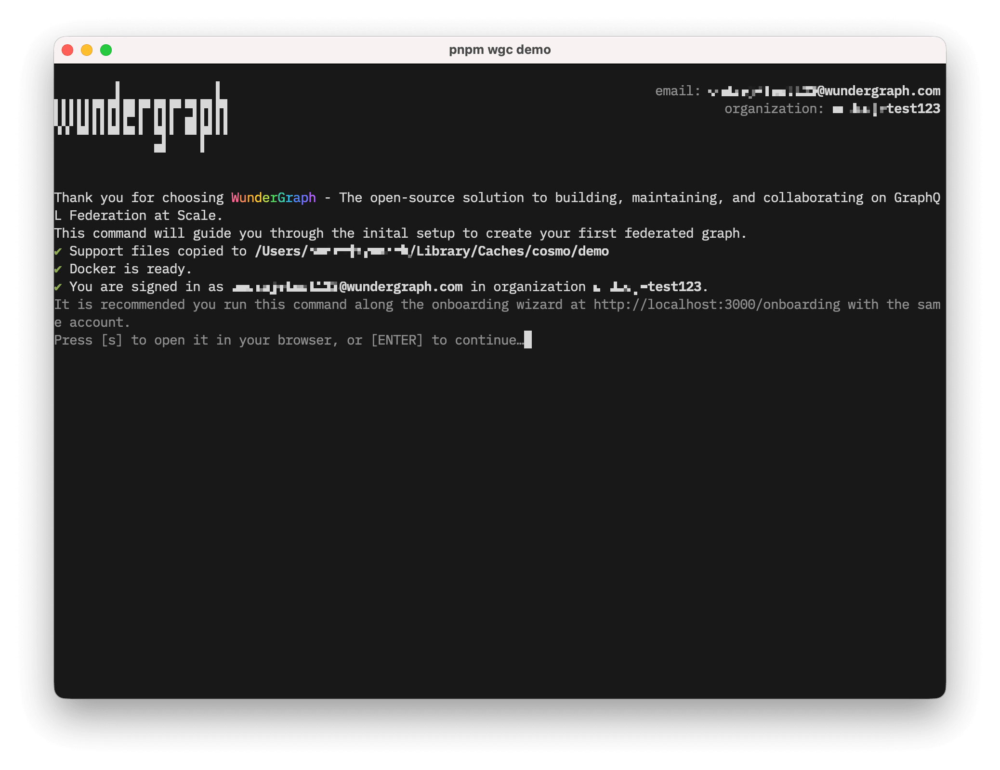

## Overview

`wgc demo` runs an interactive onboarding flow for a local Cosmo demo environment.



It is intended for first-time setup. The command prepares a demo federated graph, publishes the required demo plugins, creates a router token, and starts a local router so you can query the graph immediately.

```bash
wgc demo
```

## Requirements

Before you run the command:

* Authenticate with the CLI.

* Use an organization account that is allowed to run onboarding. The command currently requires organization owner access.

* Install Docker and make sure the Docker daemon is running.

* Install Docker Buildx. If no `docker-container` builder exists, the command creates one automatically.

## What The Command Does

The command prepares a ready-to-use local demo setup for the onboarding flow. It creates or reuses a demo federated graph in the `default` namespace, configures the required demo components, starts a local router on `http://localhost:3002`, and leaves you with a working graph that you can query immediately. If a previous demo setup already exists, you can continue with it or delete it and start over. During execution, the command also prints the path to the local log file so you can inspect router and publishing output if needed.

## Notes

`wgc demo` is intentionally guided and uses predefined values. It is meant as a tutorial entry point, not as a general-purpose graph provisioning command.

For manual graph management, use the standard CLI commands such as [`wgc federated-graph`](/cli/federated-graph), [`wgc subgraph`](/cli/subgraph), and [`wgc router token`](/cli/router/token).
