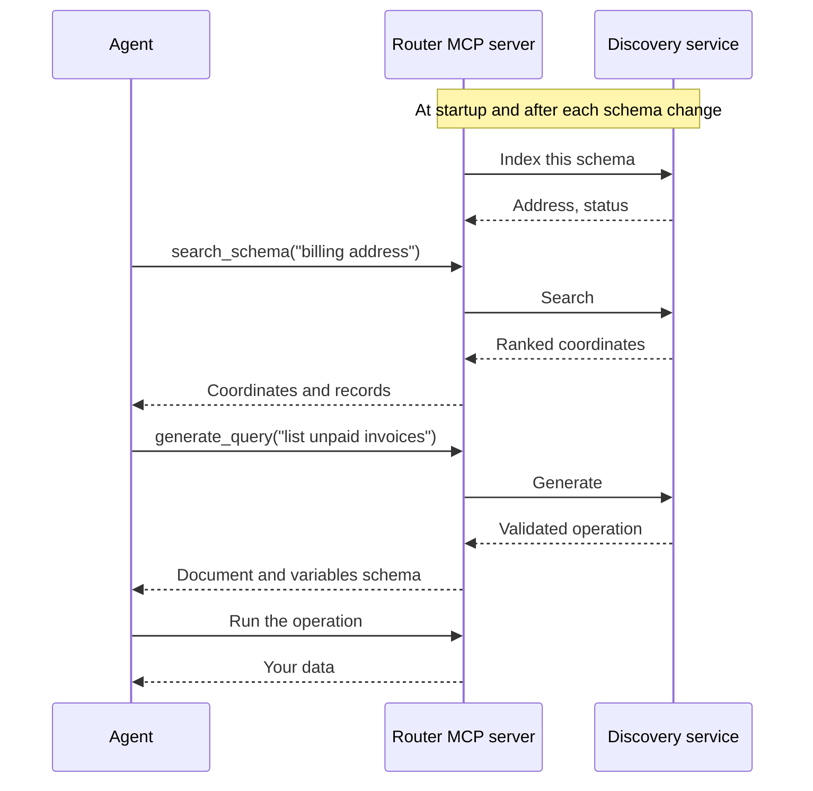

Schema discovery indexes your client schema in an external service. The MCP server then gives an agent three tools: search the schema, read schema records, and make a GraphQL operation from a prompt.

## The problem

The MCP server has two ways to show your API to an agent:

- `get_schema` returns the full schema. A large schema fills the context of the agent.
- Persisted operations become tools. Somebody must write each operation first.

Neither helps an agent that knows what it wants but does not know your schema. Neither helps a developer who wants to find out if a capability already exists.

## What schema discovery does

The router sends the client schema to the discovery service one time. The service builds an index. An agent then searches that index instead of reading the schema.

The service validates every operation against your schema before it returns it. An invalid operation never reaches the agent.

## What schema discovery does not do

- The discovery service never runs an operation. The router runs it.
- The router never writes a file. It returns the operation text.
- The router never publishes a persisted operation. You do that.
- The index holds the composed schema. It cannot show work in a subgraph that you did not publish yet.

## Use cases

### Subgraph builders

- Find out if another subgraph already has a field, before you add it.
- Search by intent, not by name. The search finds a field even when your words differ from the field name.
- After you publish, confirm that the composed schema shows what you intended.

### Platform teams

- Stop duplicate work across many teams. One search answers "does the graph do this?".
- Lower the support load. Developers find the correct field without an internal request.
- Read the `unsatisfied` results. They tell you what consumers want and the schema does not have. This is a roadmap signal.

### Enterprise governance

- The router sends the schema to the discovery service. The router sends no data and no credentials.
- The router indexes the client schema only. Federation internals stay in the router.
- The service never runs an operation. Authentication, rate limits, and audit logs stay in the router.
- Use the curated path for production. Generate the operation in a development router. Review the operation. Publish it as a persisted operation. Then deploy it to a production router that has arbitrary operations off.

### API and subgraph consumers

- Get a valid operation without you reading the schema.
- Put the operation and its variables schema directly into a BFF.
- Use the variables schema to type the inputs.

### Agents

- Work against a large schema without the schema in the context.
- Follow three steps: search, inspect, generate.
- Read `unsatisfied`. It is a definite answer, so the agent stops guessing.

## Design

### The address is a hash

The address of an index is the SHA-256 hash of the exact schema bytes. There is no index name and no version number.

This has one purpose. You keep no state in the discovery service. You already hold your schema, so the router computes the address at any time. If the service loses an index, the router sends the schema again and gets the same address. Deletion is never data loss.

One changed byte makes a different address. A new schema version is therefore a new index.

### Indexing is asynchronous

The router sends the schema and returns at once. The build runs in the background.

Indexing reads the whole schema and computes a vector for each element. This work takes seconds. A synchronous call would delay every router config reload by that time.

The router adopts a new address only when that address is ready. The previous index keeps serving until then. A reload never breaks a working tool.

An unchanged schema costs nothing. The router compares the hash locally and makes no network call.

### Operations are parameterized

You ask for "the first 10 employees". The service returns a `$limit` variable. It does not write `limit: 10` into the document.

Your prompt selects the shape of the operation. You supply the values at run time. One operation then serves many requests.

This matters for cost. Generation takes 10 to 30 seconds and uses a language model. A parameterized operation removes that cost from your request path.

<Note>
Do not set `expose_schema` to `true` with schema discovery. `get_schema` returns the full schema, and that is the context cost that schema discovery removes.
</Note>

## Next steps

<CardGroup cols={2}>
  <Card title="Quickstart" icon="rocket" href="/router/mcp/schema-discovery/quickstart">
    Index a schema and generate your first operation.
  </Card>
  <Card title="Guides" icon="list-check" href="/router/mcp/schema-discovery/guides">
    Solve one task at a time.
  </Card>
  <Card title="Tools" icon="wrench" href="/router/mcp/schema-discovery/tools">
    Every input and every response field.
  </Card>
  <Card title="Configuration" icon="sliders" href="/router/mcp/schema-discovery/configuration">
    Every configuration key and environment variable.
  </Card>
</CardGroup>
