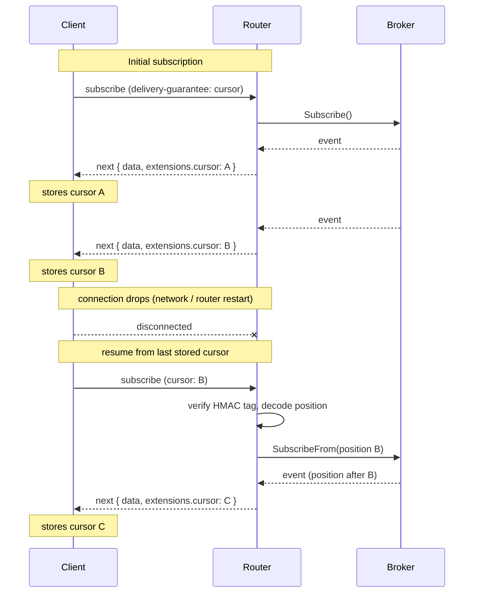

# At-Least-Once delivery guarantees for Cosmo Streams using Cursors v1

Status: Draft  
Author: Dominik Korittki  
Date: 2026.09.10

## The Problem

Today Cosmo Streams only supports at-most-once. Events are received by a broker, resolved per
subscribed client and then fanned out. This happens fire-and-forget. The router flushes a message
onto a socket without any recovery on os/network/client problems. When the router boots it connects
to a broker at queue head, ignoring every message that has arrived before that. This results in some
consequences:

- When a client disconnects and later reconnects it has missed all messages the router pushed
  meantime
- When a router stops and later restarts it misses all messages which arrived in the broker meantime
- A client has no way to recover these messages

## Scope

### Goals

- **Backwards-compatible**: Merging the feature doesn't break anything for any user. No schema
  changes, no config changes.
- **Scalable**: Works with any number of router instances, routers behind load-balancers, etc.
- **Works with WS / SSE**: Works on SSE and websocket connections
- **Receive every message at least once**: despite transport problems or offline time

### Non-Goals

- **Compensate missing broker capabilities**: If a broker can't remember its messages the router
  won't make up for that
- **Complicated, fragile designs**: If its complicated and needs a lot of time its not a good first
  iteration on the problem
- **Spec changes**: Other at-least-once options are intended to be provided eventually, but not in
  v1. [More details](#official-spec-changes)

## On a high-level

The idea is to provide clients metadata, which is sent alongside each message, which allows to track
that message on the broker it came from. When a client reconnects it provides this metadata to the
router and the router fetches messages from the broker beginning from there. This metadata can be
encoded in a token, called a **Cursor**.



### Stateless on the router

From the router POV it's stateless. It does not need to remember anything. Position tracking happens
at the client while remembering messages is done by the broker. The router also does not need to
improve its fire and forget fan-out model in this v1 RFC. It simply awaits the client's wish to
proceed from an earlier point in time.

### Burden on the client

This statelessness makes it easy to implement in the router but puts a burden on the client. The
client now needs to deal with cursors. It needs to store the last cursor, decide the commit point
(when is a received message processed?) and send it back upon reconnect.

Another challenge is how to detect missing messages. When a WS / SSE connection becomes half-open
missing messages might never be noticed. Both WS and SSE are TCP, which helps, but it does not
prevent the client from missing a message in all cases. The best advice is to instruct the client to
send heartbeats. Start missing heartbeat responses? Better reconnect with the last cursor. A
situation which should not occur is that heartbeats keep working but messages silently gone, thanks
to WS and SSE using TCP.

## Implementation

### The Cursor

The cursor is a core aspect of the Cursor-Resume strategy and hence it's defined early in this RFC.
They are created alongside GraphQL response messages and represent the subscription's position of
that message in the broker. The Cursor is designed to provide all data necessary for the router to
know where to connect and where to resume without any outside context.

A cursor is a position, not a permission. Presenting a valid cursor never confers authority. The
resumed operation is planned and authorized exactly as a fresh subscription would be.

```go
type Cursor struct {
    // "kafka", "nats-jetstream", etc.
    // Used to decode Position into a concrete type.
    ProviderType ProviderType

    // id of the provider as configured in the router yaml
    ProviderID string

    // The provider-specific message position in the broker.
    Position CursorPosition

    // The point in time when the cursor got created,
    // as a unix timestamp in milliseconds.
    IssuedAt int64
}

type ProviderType string

var (
    ProviderTypeKafka ProviderType = "kafka"
    ProviderTypeNatsJetstream ProviderType = "nats-jetstream" // not implemented in this rfc
    ProviderTypeRedisStreams ProviderType = "redis-streams" // not implemented in this rfc
)
```

The router can use `ProviderType`, `ProviderID` and `Position` from a specific offset on a specific
broker.

#### Wire format

A cursor goes over the wire as a single base64url string. The envelope carries the serialized cursor
plus the two bytes a router needs before it can make sense of either, and the tag that protects all
of it:

```
cursor = base64url( version(1) | keyID(1) | payload(n) | tag(16) )
```

- `version` selects the cursor format, so the router knows how to read the rest.
- `keyID` selects the signing key from the keyring, see [Keys](#keys).
- `payload` is the serialized `Cursor`.
- `tag` is the truncated HMAC over everything in front of it, see [Signing](#signing).

`version` and `keyID` sit in front of the payload on purpose: both are needed to decode or verify
the payload, so neither can live inside it. The tag sits behind the payload for the same reason in
reverse: a tag is calculated from the cursor bytes, so it cannot be one of the bytes it covers. That
is also why the tag is not a field on `Cursor`.

Every `MarshalBinary` implementation has to be deterministic and sort its keys before writing them,
otherwise two serializations of the same cursor produce different bytes and the tag no longer
matches.

#### Signing

Cursors travel through the client, so the client can read them and change them. To stop that, every
cursor carries an HMAC-SHA256 tag on its wire foramt, truncated to 16 bytes and keyed with a
router-side secret. The key never leaves the router.

```
tag = HMAC-SHA256(key[keyID],
        "cosmo/cursor/v1" || version || keyID || payload || requestData || clientData
      )[:16]
```

1. `"cosmo/cursor/v1"`: prefix for domain seperation; makes sure the tag can't be replayed as a valid tag somewhere else that happens to use the same secret
2. `version`: cursor version, so a cursor with a different version is considered invalid
3. `keyID`: id of the signing key, so a cursor with a different key is considered invalid
4. `payload`: serialized cursor, so a client cannot rewrite its own position, provider or timestamp
5. `requestData`: information about the request to prevent clients from resuming with a different query
6. `clientData`: information about the client to prevent a different client from using the same cursor

The tag needs no protection of its own. If the client changes the payload, the recalculated tag no
longer matches the carried one. If the client changes the tag, it no longer matches the payload. To
produce a matching pair the client would need the key, which it does not have.

##### About `requestData`

`requestData` contains information about the request to prevent clients from resuming with a different query.
It's never sent to the client. The router recalculates it from the incoming request on resume.

Anything from the operation that influences what events clients receive needs to go in here:

- `SubscriptionEventConfiguration.ProviderType()`
- `SubscriptionEventConfiguration.ProviderID()`
- alphanumerically sorted list of topics of the subscription (or channels / subjects).
  Each field is seeded with a length-boundary: `"orders" + "event" --> "6orders5event"`
  to prevent collisions.
- normalized operation document bytes, to prevent a user to replay with a different query
- canonicalized operation document variables.
  Variables enter the tag in a canonical form:
  - Object keys are sorted byte-wise by their decoded name, so that the ordering does not depend on how the client escaped them.
  - Array order preserved
  - Insignificant whitespace dropped
  - Keys and strings re-escaped through a single policy
  - Numbers emitted verbatim as the client sent them (i.e. `1` != `1.0`)

##### About `clientData`

`clientData` binds a cursor to the identity that was authenticated when it was
issued, so a cursor that leaks cannot be resumed by somebody else. Like
`requestData` it is never sent to the client; the router recalculates it from the
incoming request on resume.

`clientData` contains:

1. `Authentication.Authenticator()` — the name of the authenticator that handled
   the request
2. the `iss` claim
3. the `aud` claim, sorted byte-wise when it is an array
4. the configured identity claim, `sub` by default

Each field is length-prefixed for the same reason the topic list is: without it,
authenticator `auth` with subject `0123` and authenticator `auth0` with subject
`123` serialize to the same bytes. The boundary between `requestData` and
`clientData` in the tag input is framed the same way.

##### Verification on resume

The order matters here. The router verifies before it decodes, and it verifies over the bytes it
received, not over a re-serialized cursor. `KafkaCursorPosition` is a map and Go randomizes map
iteration order, so a second serialization of the same cursor would produce different bytes and a
tag mismatch, which is also why the payload has to be serialized deterministically in the first
place.

1. base64-decode and check the length (at least version + keyID + tag)
2. read `version` and `keyID`, look up the key in the keyring, reject on an unknown or no-longer-
   verifiable `keyID` (see [Keys](#keys) for when a key stops being verifiable)
3. split off the last 16 bytes as the carried tag, everything before it is signed
4. recalculate `requestData` from the incoming request and recalculate the tag
5. compare with `hmac.Equal`, never with `==` or `bytes.Equal`, so the comparison stays constant
   time and the tag cannot be guessed byte by byte
6. only now decode the payload into the `Cursor` type
7. reject the cursor if `IssuedAt` is older than the configured maximum resume window

Step 7 is what keeps a tag from staying valid forever. Without it a leaked cursor works until the
key is rotated.

Steps 2 and 7 are independent gates, not a fallback for one another. Being inside `max_resume_window`
never overrides an invalid key: if the key a cursor was signed with is no longer verifiable, the
cursor is rejected at step 2 regardless of how young `IssuedAt` is. `max_resume_window` only bounds
how far back an *otherwise-valid* key is willing to look.

A cursor that fails any of these steps fails the subscription with a distinct error code. A fallback
to a fresh subscription is deliberately not made: that would silently hide both attacks and
misconfigured keys behind a subscription that merely looks like it works.

##### Keys

`KeyID` selects the key from a small keyring the router holds. The router signs with the newest key.

`expires_at` on a key is a **signing** cutoff, not a **verification** cutoff. Past it the router
stops issuing new cursors with that key, but it keeps accepting the key for verification until
`expires_at + max_resume_window`. Without that extra window a cursor issued an instant before
`expires_at` would have its resume window cut short: it could still be within `max_resume_window` of
its `IssuedAt` and yet be rejected because the key that signed it looks expired. Retaining the key for
the full resume window past its own expiry closes that gap. This is also why `expires_at` should not
be set closer than `max_resume_window` to the previous key's rotation, or the ring runs out of still-
verifiable keys for cursors issued right at the boundary.

The key is configuration, not something a router generates at startup. Two router replicas behind a
load balancer have to derive the same key, otherwise a resume that lands on another replica fails.
It is derived from the router secret with HKDF and a `"cosmo/cursor"` label, so the same secret can
still serve other purposes.

Note that the tag protects integrity, not confidentiality. The payload is only base64, so anybody
can read the broker offsets out of a cursor.

#### Cursor Positions

Describing message positions is highly broker specific. Some have offsets, other use indexes, etc.
Therefore an interface was chosen to abstract it. Any implementation needs to provide a way to
encode the position into a compact byte sequence and to read that sequence back. This byte sequence
is used on the cursor on the wire.

```go
type CursorPosition interface {
    encoding.BinaryMarshaler
    encoding.BinaryUnmarshaler
}
```

This interface is implemented by all broker adapters on which Cursor-Resume is meant to be
supported.

##### Kafka Positions

A good example of how different brokers track messages in "unusual" ways is Kafka.  
The router always consumes a Kafka topic. But a topic itself does not hold messages.  
Instead topics hold one or more partitions and these in turn hold the actual messages.  
Order of messages is only preserved inside a partition but not inside a topic. So when the router
reads messages from a topic it reads randomly from its partitions, or from whatever partition
receives a message first.

To describe where the router stands on a Kafka topic when it delivers a message it needs to remember
all positions of already read messages of all partitions of a topic.

It's worth remembering that on a GraphQL schema multiple topics can be defined per EDFS
subscription. So all in all for Kafka the message offset needs to be recorded for all partitions of
all topics of a subscription.

```go
// KafkaCursorPosition can contain multiple topics (key)
// and each topic can contain multiple partitions (value)
type KafkaCursorPosition map[string]partitionPositions

func (p KafkaCursorPosition) MarshalBinary() ([]byte, error) {
    // do marshaling and return it
}

// Pointer receiver, so the map can be filled in place.
func (p *KafkaCursorPosition) UnmarshalBinary(data []byte) error {
    // do unmarshaling
}

// List of partitions with a their offsets.
// Key = partition index, Value = offset of the last delivered message in that partition.
type partitionPositions map[int32]partitionOffset

type partitionOffset struct {
    // leader epoch of the partition at the time the message was read,
    // used for detecting log truncation on resume
    epoch int32

    // offset of the message in the partition
    offset int64
}
```

###### Leader epoch

An offset alone does not identify a message. Kafka increments the leader epoch of a partition every
time a new leader is elected for it, and an unclean election can leave the new leader with a shorter
log than the old one had. The records above the truncation point are gone, and the offsets they
occupied are handed out again to different records. A cursor that carries only an offset would
silently resume in the middle of a different message stream.

That is why the leader epoch is recorded alongside the offset. On resume the router hands the broker
the pair instead of the bare offset, and the broker answers whether that epoch still holds at that
offset. If the log was truncated below it, the broker says so and returns the offset the log
actually ends at now.

That reset is not silently followed: the messages between the two offsets are lost, and resuming
anyway would look like an uninterrupted stream while quietly breaking the delivery guarantee. A
truncated cursor fails the subscription with its own error code, the same way a cursor that fails
verification does, so the gap is visible to the client instead of hidden from it.

#### Decoding

Everything the router needs to start decoding sits outside the `Cursor` itself. The `version` byte
of the envelope selects the concretely versioned type the payload is decoded into, and it is read
before the payload is touched at all. The cursor cannot carry its own version: the router would have
to decode it to learn how to decode it.

Within the payload the same applies one level down. `Cursor.Position` is an interface, so the router
needs a concrete type before it can unmarshal the position bytes, and it takes that from
`Cursor.ProviderType`. `ProviderType` therefore has to be decoded before `Position`, which means it
has to be written before `Position` on the wire.

### Transport

This section specifies how a cursor is transmitted and received between client and router.

#### Foundations

- Clients express their wish to receive a cursor. If that wish is not expressed the router falls
  back to the usual at-most-once delivery
- Cursors are managed per subscription, not per connection (you can have multiple subscriptions on
  one connection)
- A Cursor is sent in the wire format described here [here](#wire-format)

#### Official Spec Changes

It's a territory where the aim is to enhance official specs like
[graphql-transport-ws](https://github.com/enisdenjo/graphql-ws),
[graphql-sse](https://github.com/enisdenjo/graphql-sse) and maybe
[GraphQL GAP](https://graphql.org/blog/2026-06-01-announcing-gaps/). The intent is to include
things like capability negotiations ("dear server, at-least-once methods XYZ are supported here,
what is supported on your side?") and ACK responses ("dear server, message #132 has been
received").  
However this aspect was not included in At-Least-Once v1. These spec changes need a public,
community-driven discussion with potentially huge changes as the spec progresses. It's also not
clear how long it takes until the spec changes are accepted. The project is meant to stay
independent and be delivered within a reasonably short period of time.  
However, commitment to these spec changes stands, as they are considered valuable to the GraphQL
ecosystem. The big end goal is a public spec for at-least-once, which is supported here, but it has
to start somewhere.

For the time being, use is made of the extensibility of current specifications.

#### Client <-> Router handshake

This section specifies how a client can signal the need for cursors to the router.

The handshake has to be initiated on subscription request. Both relevant subprotocols,
graphql-transport-ws and graphql-sse, support metadata on subscription requests.

- graphql-transport-ws: Specify a free-form map on `payload.extensions` on
  [suscribe requests](https://github.com/enisdenjo/graphql-ws/blob/master/PROTOCOL.md#subscribe)
- graphql-sse: Specify a free-form map on `payload.extensions` (indirectly via
  [GraphQL-Over-HTTP subscription requests](https://github.com/graphql/graphql-over-http/blob/main/spec/GraphQLOverHTTP.md#graphql-over-http-request))

On both subprotocols the client can add the key `delivery-guarantee`. It accepts a comma-separated
list of capabilities the client supports. Priority is from left to right (highest to lowest). The
router picks the highest priority guarantee it supports (configurable). The following values are
allowed

- `cursor`
- `at-most-once`

If `delivery-guarantee` is not specified or its value is null `at-most-once` is used.

The value has to be a string.

##### Negotiation success

If client and router both agree to use cursors the router will confirm this to the client

- graphql-sse: via `x-cosmo-at-least-once-capabilities: cursor` response header, available before
  the first event
- graphql-transport-ws: `extensions.at-least-once-capabilities` on the first `next` message, since
  the subprotocol has no per-subscription ack frame in v1

##### Negotiation failure

###### DELIVERY_GUARANTEE_UNSUPPORTED

In case the router won't support any guarantees the client listed it will terminate the subscription
with an error. For both subprotocols two fields can be defined which indicate the nature of the
error:

- `code`: An error code indicating the reason why the server refused
- `supported`: A string array with supported guarantees

The only allowed value for `code` to return in this case is `DELIVERY_GUARANTEE_UNSUPPORTED`.

Depending on the subprotocol they have to be delivered in different ways.

###### graphql-transport-ws
On graphql-transport-ws the router sends an
[Error message](https://github.com/enisdenjo/graphql-ws/blob/master/PROTOCOL.md#error) with two
items on `payload.extensions`:

Example:

```json
{
  "id": "1",
  "type": "error",
  "payload": [
    {
      "message": "Subscription requires delivery guarantee 'cursor', which this router cannot provide.",
      "extensions": {
        "code": "DELIVERY_GUARANTEE_UNSUPPORTED",
        "supported": ["at-most-once"]
      }
    }
  ]
}
```

###### graphql-sse

On graphql-sse there is no distinct error message type. The error has to be carried as a `next`
event with the error in the GraphQL error response of `data`, followed by a `complete` event to
terminate the subscription.

Example:

```
event: next
data: {"errors":[{"message":"Subscription requires delivery guarantee 'cursor', which this router cannot provide.","extensions":{"code":"DELIVERY_GUARANTEE_UNSUPPORTED", "supported": ["at-most-once"]}}]}

event: complete
data:
```

###### DELIVERY_GUARANTEE_UNSATISFIABLE

In case the router would like to resume but can't for any technical reason it returns
`DELIVERY_GUARANTEE_UNSATISFIABLE` in the same way as `DELIVERY_GUARANTEE_UNSUPPORTED`.

Potential reasons to return this error are
- Broker does not have the messages anymore (retention window surpassed)
- Broker misconfiguration prevents to resume

#### Sending cursors to clients

When a client successfully negotiated to use cursors the server will attach the cursor as metadata
to each message it sends to the clients subscriptions. It will do so by adding a field to the
GraphQL [Execution Results](https://spec.graphql.org/September2025/#sec-Execution-Result)
[`extensions`](https://spec.graphql.org/September2025/#sec-Extensions) field. The field is called
`cursor`. Its value is the cursor wire format described [here](#wire-format).

This works independently of any transport protocol as it relies on the GraphQL spec itself.

##### Cursors are cumulative

A cursor should not be seen as a pointer to one message but rather as the position of every message
delivered on that subscription so far. Cursor B contains everything cursor A contained.

That means resuming from a cursor acknowledges every message delivered up to and including it. A
client that stores cursor B has given up its chance to receive the message that carried cursor A.

#### Resuming clients

When a client wants to receive messages where it left off it has to provide the cursor upon
reconnect. Specifically during handshake the client adds the field `cursor` to `payload.extensions`,
similar to how it adds `delivery-guarantee`, see [handshake](#client---router-handshake). The value
of this field contains the last processed cursor as chosen by the client in
[wire format](#wire-format).

The `cursor` field is independent of `delivery-guarantee`. A client may choose to resume from a
specific event without getting new cursors.

##### Replay speed

When a client resumes the router fetches messages from the broker as fast as the broker supports.
This means clients will get messages as fast as the broker supports. This comes with some
challenges.

- Subgraph load: Every incoming event from the broker need to be resolved into a GraphQL response.
- Client TCP blocks: If a client reads slower than the router wants to write it reaches a 10s
  default timeout and the WS/SSE connection is dropped

Since resuming clients live off their own trigger a regression for other clients is not expected.

To help users manage this situation a router config parameter will be introduced to allow message
pacing. The router will read messages no faster than this pacing.

##### A word on commit points
A client provides the cursor of its last processed message when it reconnects and wants to resume
where it left off. It means the commit is basically happening at the client. The optimal commit
point could be when a client has successfully processed the event, and thats not necessarily when it
received it. Sometimes it needs to be transformed, enriched or processed in different ways until it
was successfully rendered on displays. Using this as the commit point reduces duplicate messages.

Because cursors are [cumulative](#cursors-are-cumulative), commits have to happen in delivery order.
A client that processes messages concurrently may well finish message 3 before message 2. If it
commits message 3 right away and message 2 then fails, message 2 is lost: the stored cursor already
points past it. Nobody notices, because router and broker have no idea the client skipped anything.

The rule is therefore: a client may only commit a cursor once every message delivered before it was
processed. Committing the last message of an unbroken processed prefix is always safe. Committing
anything beyond it breaks the guarantee.

### Adapters

Adapters are an abstraction inside the router to let a subscription datasource be able to deal with
different types of brokers without knowing how to actually deal with that broker.

That abstraction is today looks like this.

```go
type Adapter interface {
	Startup(ctx context.Context) error
	Shutdown(ctx context.Context) error
	Subscribe(ctx context.Context, cfg SubscriptionEventConfiguration, updater SubscriptionEventUpdater) error
	Publish(ctx context.Context, cfg PublishEventConfiguration, events []StreamEvent) error
}
```

These four methods are implemented by concrete provider adapters for Kafka, Nats and Redis today.
`Startup` and `Shutdown` manage connection lifecycles to brokers. `Subscribe` handles GraphQL
subscriptions. It listens to the broker queues for events and resolves + sends them for each
connected subscription client once they appear. `Publish` is for GraphQL mutations, sends messages
into a broker queue - not of interest for this RFC.

For cursors to work the adapters needs to be seekable, i.e. start from any given position but not
every broker can do this. Plain NATS and Redis PubSub don't provide seekable queues. NATS Jetstream
and Redis Streams however do. To reflect this a new interface is introduced for seekable adapters,
which extends normal adapters:

```go
type SeekableAdapter interface {
  Adapter
  SubscribeFrom(ctx context.Context, cfg SubscriptionEventConfiguration, position CursorPosition, updater SubscriptionEventUpdater) error
}
```

An adapter that does not implement `SeekableAdapter` cannot serve the `cursor` guarantee. The router
finds this out with a type assertion when it plans the subscription, and answers the handshake with
`DELIVERY_GUARANTEE_UNSUPPORTED` if the assertion fails.

`DecodePosition` is used when a cursor needs to be unmarshaled from wire format into a concrete
type.

For example Kafka will be a seekable adapter, so there is a concrete type called
`kafka.SeekableProviderAdapter`, which implements `SeekableAdapter`.

### Config

Everything is configured under `events.delivery-guarantees.cursor-resume`

```yaml
events:
  delivery-guarantees:
    cursor-resume:
      # makes the router advertise cursor capabilities on handshakes.
      # ignores client handshakes if false.
      enabled: true # default false

      # how long the router accepts old cursors.
      # note: should not exceed the brokers retention window.
      max_resume_window: 24h # default 3h

      # cursor hmac signing. Router uses the key with highest id.
      keys:
        - id: 1
          secret: env:COSMO_CURSOR_KEY_1
          # stops signing new cursors with this key at this time;
          # still verifies cursors signed by it until expires_at + max_resume_window
          expires_at: 2026-12-31T00:00:00Z 
        - id: 2
          secret: env:COSMO_CURSOR_KEY_2

      replay:
        flow-control:
          # router-side limit of messages flushed per client per second 
          max_messages_per_second: 100

    
  providers:
    kafka:
      - id: my-kafka
        delivery-guarantees:
          disable: # per provider overrides
            - cursor-resume
```

### Client Middleware

The handshake described above is intentionally plain: any client that can put a key into
`payload.extensions` and read one back out of `extensions` can use it. But doing it by hand means
every user reimplements the same bookkeeping — negotiate the guarantee, pull the cursor out of each
message, decide when a message counts as processed, store the cursor somewhere it survives a reload,
and hand it back on reconnect. To avoid that, dedicated npm packages are intended to be shipped that
wrap [graphql-ws](https://www.npmjs.com/package/graphql-ws) and
[graphql-sse](https://www.npmjs.com/package/graphql-sse) rather than replacing them.

Each exposes a `createClient` of its own that takes the usual options of the wrapped library plus a
small amount of at-least-once configuration, and returns a client with the same familiar API, so
existing code keeps working and users are not locked into a fork of the ecosystem.

#### A transport-agnostic core

Most of what the middleware does has nothing to do with the transport: the cursor store, the commit
semantics, the bookkeeping of "which cursor belongs to which subscription" and the decision of what
to send on the next connect are identical for WebSockets and SSE. The work is therefore split into a
core package holding that logic and two thin transport bindings on top of it. Only three things
differ per transport and live in the bindings: how the handshake keys get into the request, how the
negotiation confirmation is read back, and how liveness is detected.

#### graphql-ws

The WebSocket binding provides:

- **Cursor negotiation**: the requested `delivery-guarantee` list is injected into
  `payload.extensions` on every subscribe, and the router's confirmation (or a
  `DELIVERY_GUARANTEE_UNSUPPORTED` error) is surfaced as a typed result instead of a raw GraphQL
  error, so users can decide whether to fall back to at-most-once or fail loudly.
- **Cursor extraction**: incoming `next` messages are unwrapped and the `extensions.cursor` value is
  handed to the user alongside the payload, so nobody has to know the wire format.
- **Explicit commit**: each delivered message carries an `ack()` (name TBD) the user calls once the
  event has actually been processed. This matches the commit point argued for in
  [A word on commit points](#a-word-on-commit-points) — the client decides what "processed" means.
  `ack()` does not persist that message's cursor directly. It marks the message as processed and
  persists the cursor of the longest unbroken processed prefix. Acking message 3 while 2 is still
  open stores nothing; acking 2 then stores the cursor of 3. This keeps out-of-order acks safe: the
  worst case is that a few already processed messages arrive again after a resume, which
  at-least-once allows. Two consequences follow. An `ack()` that is never called stalls the stored
  cursor, so the package caps the number of open messages and raises an error when the cap is hit.
  And since resumes can repeat messages, handlers have to be idempotent.
- **Pluggable cursor storage**: the package ships a `CursorStore` interface with implementations for
  in-memory (default), `localStorage`/`IndexedDB` when running in a browser, and a file on disk for
  Node. Users with other requirements (a database, a service worker, an encrypted store) implement
  the interface themselves. Cursors are keyed per subscription, matching the per-subscription cursor
  model of the transport.
- **Heartbeats and liveness**: graphql-ws already has `Ping`/`Pong` messages and a client-side
  `keepAlive` option, so a heartbeat does not need to be invented. What is added is a sane default
  (heartbeats on, with an interval and a missed-heartbeat threshold) and the reaction: when the
  configured number of pongs is missed, the connection is torn down and re-established, resuming
  from the last persisted cursor instead of from "now".
- **Manual connection control**: `disconnect()` and `resume()` (name TBD) let users park a
  subscription — a backgrounded tab, a device going offline, a deliberate backpressure decision —
  and later reconnect from the stored cursor, without waiting for a heartbeat to fail.

#### graphql-sse

The same feature set is wanted for graphql-sse in v1. An SSE `next` event carries a plain GraphQL
execution result, so cursor negotiation, cursor extraction, explicit commit and pluggable storage
work exactly as they do over WebSockets. The SSE binding differs in three places:

- **Handshake**: graphql-sse has two modes — one HTTP request per operation, or one shared stream
  with a reservation. Both send a GraphQL request body on subscribe, so `delivery-guarantee` and
  `cursor` go into `extensions` the same way in both.
- **Negotiation confirmation**: the graphql-sse client never hands the caller the HTTP `Response`,
  so the `x-cosmo-at-least-once-capabilities` header is awkward to read, and on a shared stream it
  arrives on a different request than the events. **Recommended RFC change**: confirm in-band on the
  first `next` message's `extensions`, as graphql-transport-ws already does, and keep the header
  only for clients not using the package. See [Negotiation success](#negotiation-success).
- **Liveness**: the real gap, see below.
- **Reconnect and manual control**: the binding disables the built-in retry and drives reconnects
  itself, rebuilding the subscribe request from the cursor store, so `disconnect()`/`resume()` and
  the reconnect policy are shared with the WebSocket binding.

**On liveness**: SSE is one-directional, so the client cannot ping — it can only listen. The server
proves it is alive by emitting SSE keepalive comments, but the graphql-sse parser discards comments
and the client has no idle-timeout option, so an idle stream and a dead stream look identical to the
application. The binding closes the gap by supplying its own `fetchFn` (a documented client option),
watching the raw response bytes for silence and aborting the request when the threshold is exceeded.
graphql-sse sees an ordinary network failure and takes the reconnect path already used for resuming.
This requires the router to emit keepalive comments at a known interval, which has to become a
configurable router setting so both thresholds can be matched.

SSE's native `id:` / `Last-Event-ID` resumption is deliberately not used: graphql-sse does not
define event ids, and it would introduce a second cursor channel that works on only one transport.


# Todos
- [x] Goals / Non-Goals
- [x] Cursors
- [x] Transport
- [x] Adapters
- [x] Config
- [x] Client Middleware
