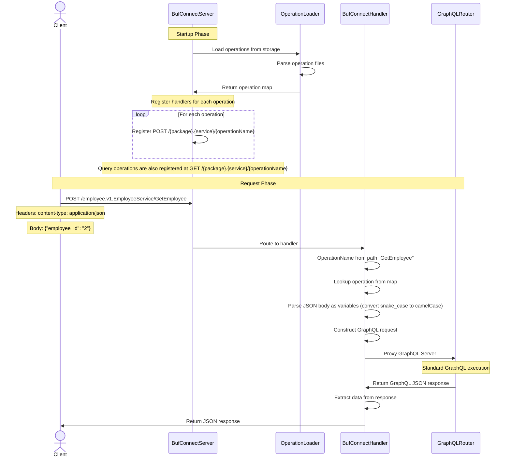

## OperationCollection approach

The Operation Collection approach exposes GraphQL operations as Connect RPC endpoints without requiring proto files at 
runtime. At startup, the router loads pre-written GraphQL operations from storage and registers a handler for each 
operation at /{package}.{service}/{operationName}. When a JSON request arrives, the router extracts the operation name 
from the URL path, looks up the corresponding GraphQL query, converts the JSON request body to GraphQL variables 
(snake_case -> camelCase), executes the query against the GraphQL server, and returns the JSON response.

This approach is intentionally naive. It supports only JSON requests (no binary proto), handles a single service per 
router instance, and requires manually maintaining Buf Connect protocol compatibility. The intention is to be able to 
provide a clear evolution path so that we can de-risk, go to market quickly, and act on customer feedback.

e.g. in future, we would want to support binary proto requests, multiple services per router, and streaming.

```yaml
# buf_connect.config.yaml

connect_rpc:
  enabled: true
  server:
    listen_addr: http://localhost:5026
    package: employee.v1
    service: EmployeeService
  storage:
    provider_id: operations

storage_providers:
  file_system:
    - id: connect
      path: path-to-collection-of-operations/operations # relative to the router binary
```



## Limitations

### 1. **Buf Connect Protocol Maintenance Burden**=
- Reverse-engineer and maintain compatibility with Buf Connect protocol
- Breaking changes in Buf Connect require updates
- Cannot leverage official Buf Connect libraries (they expect real proto)

**Maintenance Required:**
- HTTP/2 and HTTP/1.1 protocol handling
- Content-Type negotiation (application/json, application/proto)
- Connect-Protocol-Version header handling
- Error code mapping (Connect codes <-> GraphQL errors)
- Streaming protocol (if added later)
- Compression handling (gzip, etc.)
- Timeout propagation
- Metadata/header handling

### 2. Single Service Per Server
- One package.service per Connect RPC server
- Cannot load multiple proto services from the same router instance
- Each service requires its own cosmo router

**Example:**
```yaml
# NOT SUPPORTED - Multiple services
connect_rpc:
  enabled: true
  server:
    listen_addr: http://localhost:5026
    package: employee.v1
    service: EmployeeService  # Only this service
    # Cannot add: DepartmentService, ProjectService, etc.
```
