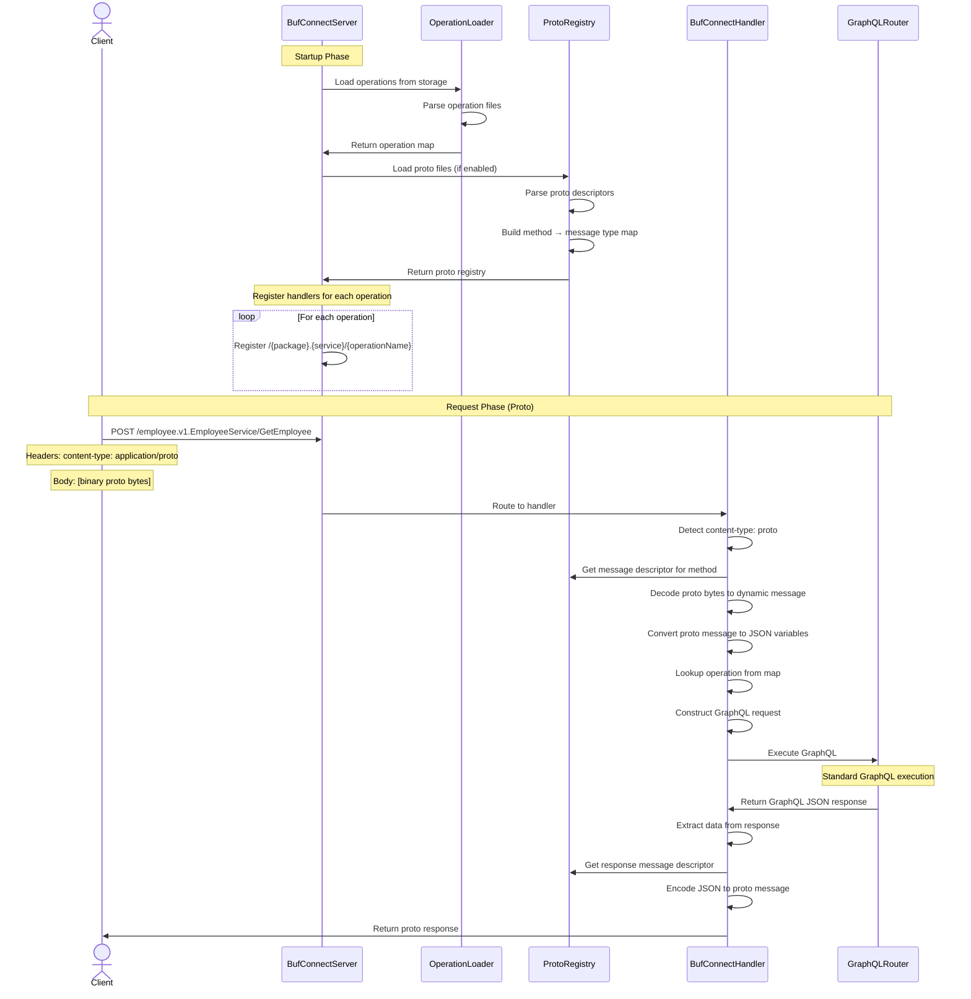

# Operation Collection with Proto Support (Approach 2b)

## Overview
Extends the Operation Collection approach to support both JSON and binary proto requests/responses while maintaining the same operation-centric architecture.

## Configuration

```yaml
# buf_connect.config.yaml

connect_rpc:
  enabled: true
  server:
    listen_addr: http://localhost:5026
    package: employee.v1
    service: EmployeeService
  storage:
    provider_id: operations
  proto:
    enabled: true  # NEW: Enable proto support
    files:         # NEW: Proto file paths
      - path: /path/to/employee.proto
      - path: /path/to/common.proto

storage_providers:
  file_system:
    - id: operations
      path: /path/to/operations
```

## Architecture Flow



## Key Components

### 1. Proto Registry
```go
type ProtoRegistry struct {
    files *protoregistry.Files
    methods map[string]*MethodDescriptor
}

type MethodDescriptor struct {
    RequestType  protoreflect.MessageDescriptor
    ResponseType protoreflect.MessageDescriptor
    OperationName string
}
```

### 2. Content Negotiation
```go
func (h *Handler) ServeHTTP(w http.ResponseWriter, r *http.Request) {
    contentType := r.Header.Get("Content-Type")
    
    switch {
    case strings.Contains(contentType, "application/proto"):
        h.handleProtoRequest(w, r)
    case strings.Contains(contentType, "application/json"):
        h.handleJSONRequest(w, r)
    default:
        // Default to JSON
        h.handleJSONRequest(w, r)
    }
}
```

### 3. Proto Request Handling
```go
func (h *Handler) handleProtoRequest(w http.ResponseWriter, r *http.Request) {
    // 1. Extract method name from path
    methodName := extractMethodName(r.URL.Path)
    
    // 2. Get proto descriptor
    descriptor := h.protoRegistry.GetMethod(methodName)
    
    // 3. Decode proto bytes
    protoBytes, _ := io.ReadAll(r.Body)
    dynamicMsg := dynamicpb.NewMessage(descriptor.RequestType)
    proto.Unmarshal(protoBytes, dynamicMsg)
    
    // 4. Convert proto to JSON variables
    variables := protoToVariables(dynamicMsg)
    
    // 5. Lookup operation
    operation := h.operations[methodName]
    
    // 6. Execute GraphQL
    response := h.executeGraphQL(operation, variables)
    
    // 7. Encode response to proto
    responseMsg := jsonToProto(response, descriptor.ResponseType)
    protoBytes, _ = proto.Marshal(responseMsg)
    
    // 8. Return proto response
    w.Header().Set("Content-Type", "application/proto")
    w.Write(protoBytes)
}
```

### 4. Proto ↔ JSON Conversion
```go
// Convert proto message to GraphQL variables
func protoToVariables(msg protoreflect.Message) map[string]interface{} {
    variables := make(map[string]interface{})
    
    msg.Range(func(fd protoreflect.FieldDescriptor, v protoreflect.Value) bool {
        fieldName := string(fd.Name())
        
        // Convert snake_case to camelCase for GraphQL
        graphqlName := snakeToCamel(fieldName)
        
        // Convert proto value to Go interface
        variables[graphqlName] = protoValueToInterface(v, fd)
        return true
    })
    
    return variables
}

// Convert GraphQL JSON response to proto message
func jsonToProto(jsonData []byte, msgDesc protoreflect.MessageDescriptor) proto.Message {
    msg := dynamicpb.NewMessage(msgDesc)
    
    // Use protojson for unmarshaling
    unmarshaler := protojson.UnmarshalOptions{
        DiscardUnknown: true,
    }
    unmarshaler.Unmarshal(jsonData, msg)
    
    return msg
}
```

## Operation Files (Same as 2a)

```graphql
# GetEmployee.graphql
query GetEmployee($employeeId: ID!) {
  employee(id: $employeeId) {
    id
    name
    email
    department {
      id
      name
    }
  }
}
```

## Proto Files

```protobuf
// employee.proto
syntax = "proto3";

package employee.v1;

service EmployeeService {
  rpc GetEmployee(GetEmployeeRequest) returns (GetEmployeeResponse);
  rpc CreateEmployee(CreateEmployeeRequest) returns (CreateEmployeeResponse);
}

message GetEmployeeRequest {
  string employee_id = 1;
}

message GetEmployeeResponse {
  Employee employee = 1;
}

message Employee {
  string id = 1;
  string name = 2;
  string email = 3;
  Department department = 4;
}

message Department {
  string id = 1;
  string name = 2;
}
```

## Request/Response Examples

### JSON Request (Same as 2a)
```http
POST /employee.v1.EmployeeService/GetEmployee HTTP/1.1
Content-Type: application/json
Connect-Protocol-Version: 1

{"employee_id": "2"}
```

### Proto Request (NEW)
```http
POST /employee.v1.EmployeeService/GetEmployee HTTP/1.1
Content-Type: application/proto
Connect-Protocol-Version: 1

[binary proto bytes]
```

### Response Handling
```go
// Server detects request content-type and responds in same format
if requestContentType == "application/proto" {
    // Return proto response
    w.Header().Set("Content-Type", "application/proto")
    w.Write(protoBytes)
} else {
    // Return JSON response
    w.Header().Set("Content-Type", "application/json")
    w.Write(jsonBytes)
}
```

## Implementation Phases

### Phase 1: Extend 2a with Proto Loading
- [ ] Add proto file configuration
- [ ] Load proto files at startup
- [ ] Build proto registry (method → descriptors)
- [ ] Keep existing JSON handling

### Phase 2: Add Proto Request Handling
- [ ] Detect content-type
- [ ] Decode proto requests
- [ ] Convert proto → JSON variables
- [ ] Reuse existing GraphQL execution

### Phase 3: Add Proto Response Encoding
- [ ] Convert GraphQL JSON → proto
- [ ] Encode proto response
- [ ] Handle field name mapping

### Phase 4: Optimization
- [ ] Cache proto descriptors
- [ ] Pool dynamic messages
- [ ] Optimize conversions

## Advantages Over 2a

| Feature | 2a (JSON-Only) | 2b (Proto Support) |
|---------|----------------|-------------------|
| Binary Protocol | ❌ | ✅ |
| Efficiency | JSON overhead | Binary proto |
| Mobile Clients | ⚠️ JSON only | ✅ Optimal |
| Type Validation | GraphQL only | Proto + GraphQL |
| Backward Compat | ✅ | ✅ (supports JSON too) |

## Migration Path from 2a

1. **Add proto configuration** (optional)
2. **Load proto files** (if configured)
3. **Keep JSON handling** (default)
4. **Add proto handling** (when proto files present)
5. **Clients choose format** (via Content-Type header)

## Key Design Decisions

### 1. Proto is Optional
- If `proto.enabled: false` → behaves like 2a
- If `proto.enabled: true` → supports both JSON and proto

### 2. Operation Collection is Source of Truth
- Operations define the GraphQL queries
- Proto only used for encoding/decoding
- Same operations work for both JSON and proto

### 3. Content Negotiation
- Client controls format via `Content-Type` header
- Server responds in same format as request
- No protocol conversion needed

### 4. Field Name Mapping
```
Proto: employee_id (snake_case)
  ↓
GraphQL: employeeId (camelCase)
  ↓
Proto Response: employee_id (snake_case)
```

## Error Handling

### Proto Decoding Errors
```go
if err := proto.Unmarshal(bytes, msg); err != nil {
    return connect.NewError(connect.CodeInvalidArgument, err)
}
```

### Proto Encoding Errors
```go
if err := proto.Marshal(msg); err != nil {
    return connect.NewError(connect.CodeInternal, err)
}
```

### GraphQL Errors (Same as 2a)
```go
if len(gqlResponse.Errors) > 0 {
    return connect.NewError(connect.CodeInternal, 
        fmt.Errorf("GraphQL errors: %v", gqlResponse.Errors))
}
```

## Testing Strategy

### Unit Tests
- Proto encoding/decoding
- Field name conversion
- Error handling

### Integration Tests
- JSON requests → JSON responses
- Proto requests → Proto responses
- Mixed clients (some JSON, some proto)

### Performance Tests
- Compare JSON vs proto payload sizes
- Measure encoding/decoding overhead
- Benchmark throughput

## Recommendation

**Start with 2a, add proto support when needed:**

1. ✅ Implement 2a first (simpler, faster)
2. ✅ Validate operation collection pattern
3. ✅ Add proto support incrementally
4. ✅ Clients choose format based on needs

This approach gives you:
- Quick time to market (2a)
- Future-proof architecture (can add proto)
- Flexibility (clients choose format)
- No breaking changes (additive only)